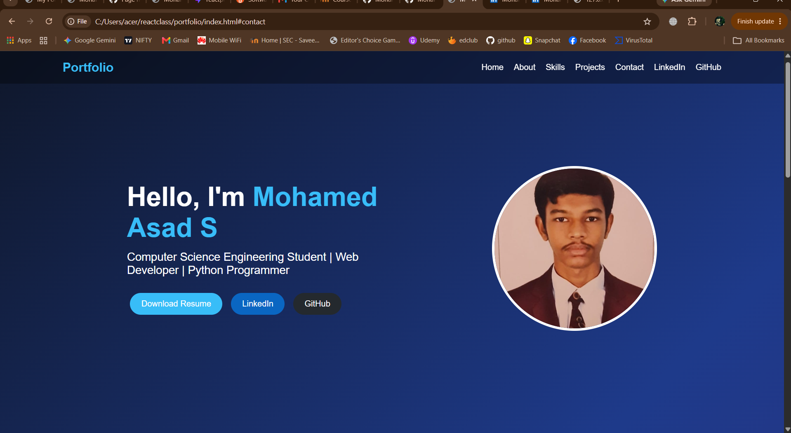

# Ex01 Portfolio
## Date: 24.07.2026

## AIM
To create a Portfolio using HTML and CSS.

## ALGORITHM
### STEP 1
Create an HTML file (index.html)

### STEP 2
Create a CSS file (style.css)

### STEP 3
Include a navigation bar with links to different sections.

### STEP 4
Add structured sections for introduction, about, projects, and contact details.

### STEP 5
Define global styles for fonts, colors, and layout.

### STEP 6
Style the header, navigation bar, and sections.

### STEP 7
Use Flexbox or CSS Grid for layout design.

### STEP 8
Add hover effects and transitions for interactivity.

### STEP 9
Add Images and Media.

### STEP 10
Use optimized images for a professional look.

### STEP 11
Open the HTML file in a browser to check layout and functionality.

### STEP 12
Fix styling issues and refine content placement.

### STEP 13
Deploy the Portfolio.

### STEP 14
Upload to GitHub Pages for free hosting.

## PROGRAM
index.html
```
<!DOCTYPE html>
<html lang="en">
<head>
<meta charset="UTF-8">
<meta name="viewport" content="width=device-width, initial-scale=1.0">
<title>Mohamed Asad S | Portfolio</title>
<link rel="stylesheet" href="style.css">
</head>
<body>
<header>
<nav>
<h2 class="logo">Portfolio</h2>
<ul>
<li><a href="#home">Home</a></li>
<li><a href="#about">About</a></li>
<li><a href="#skills">Skills</a></li>
<li><a href="#projects">Projects</a></li>
<li><a href="#contact">Contact</a></li>
<li><a href="https://www.linkedin.com/in/your-linkedin-profile" target="_blank">LinkedIn</a></li>
<li><a href="https://github.com/yourusername" target="_blank">GitHub</a></li>
</ul>
</nav>
</header>

<section id="home" class="hero">
<div class="hero-text">
<h1>Hello, I'm <span>Mohamed Asad S</span></h1>
<p>Computer Science Engineering Student | Web Developer | Python Programmer</p>
<a href="#" class="btn">Download Resume</a>
<a href="https://www.linkedin.com/in/your-linkedin-profile" target="_blank" class="linkedin-btn">LinkedIn</a>
<a href="https://github.com/yourusername" target="_blank" class="github-btn">GitHub</a>
</div>
<div class="hero-image">

</div>
</section>

<section id="about">
<h2>About Me</h2>
<p>Hello! I'm <b>Mohamed Asad S</b>, a Computer Science Engineering student passionate about web development, software engineering, and emerging technologies. I enjoy building responsive websites, solving programming problems, and learning new technologies. My goal is to become a Full Stack Developer while continuously improving my technical and problem-solving skills.</p>
</section>

<section id="skills">
<h2>Skills</h2>
<div class="project-container">
<div class="card"><h3>HTML & CSS</h3><p>Responsive web design and modern layouts.</p></div>
<div class="card"><h3>Python</h3><p>OOP, NumPy, Pandas and automation.</p></div>
<div class="card"><h3>Java & C</h3><p>Programming fundamentals and problem solving.</p></div>
<div class="card"><h3>Git & GitHub</h3><p>Version control and project hosting.</p></div>
</div>
</section>

<section id="projects">
<h2>Featured Projects</h2>
<div class="project-container">
<div class="card">
<h3>🌐 Portfolio Website</h3>
<p>A modern responsive personal portfolio built using HTML and CSS.</p>
<a class="project-btn" href="https://github.com/yourusername/portfolio" target="_blank">View Repository</a>
</div>
<div class="card">
<h3>🐍 Python Projects</h3>
<p>Collection of Python applications including file handling, OOP and data analysis.</p>
<a class="project-btn" href="https://github.com/yourusername/python-projects" target="_blank">View Repository</a>
</div>
<div class="card">
<h3>🤖 Machine Learning</h3>
<p>Regression, clustering and prediction projects using Scikit-learn.</p>
<a class="project-btn" href="https://github.com/yourusername/ml-projects" target="_blank">View Repository</a>
</div>
<div class="card">
<h3>📱 Responsive Web Apps</h3>
<p>Landing pages and UI projects with mobile-friendly design.</p>
<a class="project-btn" href="https://github.com/yourusername/web-projects" target="_blank">View Repository</a>
</div>
</div>
</section>

<section id="contact">
<h2>Contact Me</h2>
<p>📧 Email: <a href="mailto:asad@email.com">asadmohamed2007.s@gmail.com</a></p>
<p>📞 Phone: +91 93611 54063</p>
<p>💼 LinkedIn: <a href="https://www.linkedin.com/in/mohamed-asad-s-380317381/?lipi=urn%3Ali%3Apage%3Ad_flagship3_profile_view_base_contact_details%3BvS850LAQT4WJez5FDhd9oA%3D%3D" target="_blank">linkedin.com/in/inkedin-profile</a></p>
<p>🐙 GitHub: <a href="https://github.com/Mohamed-Asad-S" target="_blank">github.com/Mohamed Asad S</a></p>
<p>📍 Chennai, Tamil Nadu, India</p>
</section>

<footer>
<p>© 2026 Mohamed Asad S | All Rights Reserved</p>
</footer>
</body>
</html>
```

style.css
```
*{margin:0;padding:0;box-sizing:border-box;font-family:Arial,sans-serif}
html{scroll-behavior:smooth}
body{background:linear-gradient(135deg,#0f172a,#1e3a8a,#312e81);color:#fff}
header{position:sticky;top:0;background:rgba(0,0,0,.35);backdrop-filter:blur(8px);padding:18px 8%}
nav{display:flex;justify-content:space-between;align-items:center}
.logo{color:#38bdf8}
nav ul{display:flex;list-style:none;gap:20px;flex-wrap:wrap}
nav a{text-decoration:none;color:#fff;transition:.3s}
nav a:hover{color:#38bdf8}
.hero{display:flex;justify-content:space-around;align-items:center;min-height:90vh;padding:60px 10%;flex-wrap:wrap}
.hero-text{max-width:520px}
.hero h1{font-size:52px;margin-bottom:15px}
.hero span{color:#38bdf8}
.hero p{font-size:22px;margin-bottom:25px}
.hero-image img{width:320px;height:320px;border-radius:50%;object-fit:cover;border:5px solid #fff}
.btn,.linkedin-btn,.github-btn,.project-btn{display:inline-block;text-decoration:none;color:#fff;padding:12px 22px;border-radius:30px;margin:6px;transition:.3s}
.btn,.project-btn{background:#38bdf8}
.linkedin-btn{background:#0A66C2}
.github-btn{background:#24292e}
.btn:hover,.project-btn:hover{background:#0284c7}
.linkedin-btn:hover{background:#004182}
.github-btn:hover{background:#000}
section{padding:80px 10%}
section h2{text-align:center;margin-bottom:30px;color:#38bdf8}
#about p{text-align:justify;line-height:1.8;font-size:18px}
.project-container{display:grid;grid-template-columns:repeat(auto-fit,minmax(250px,1fr));gap:25px}
.card{background:rgba(255,255,255,.12);backdrop-filter:blur(10px);padding:25px;border-radius:18px;text-align:center;transition:.3s}
.card:hover{transform:translateY(-10px);box-shadow:0 10px 25px rgba(0,0,0,.4)}
.card h3{margin-bottom:15px}
.card p{margin-bottom:18px;line-height:1.6}
#contact{text-align:center}
#contact p{margin:14px 0;font-size:18px}
#contact a{color:#38bdf8}
footer{text-align:center;padding:20px;background:rgba(0,0,0,.35)}
@media(max-width:768px){
.hero{flex-direction:column-reverse;text-align:center}
.hero h1{font-size:40px}
.hero-image img{width:240px;height:240px}
nav{flex-direction:column}
}
```

## OUTPUT


## RESULT
The program for creating Portfolio using HTML and CSS is executed successfully.
